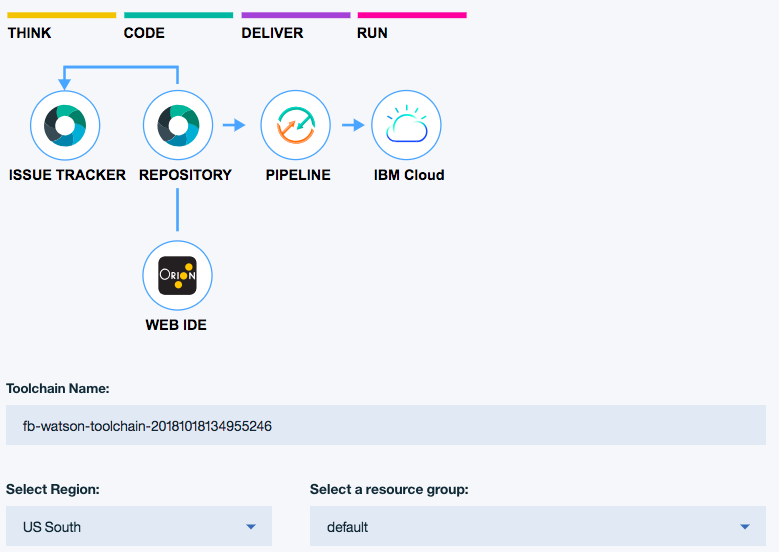
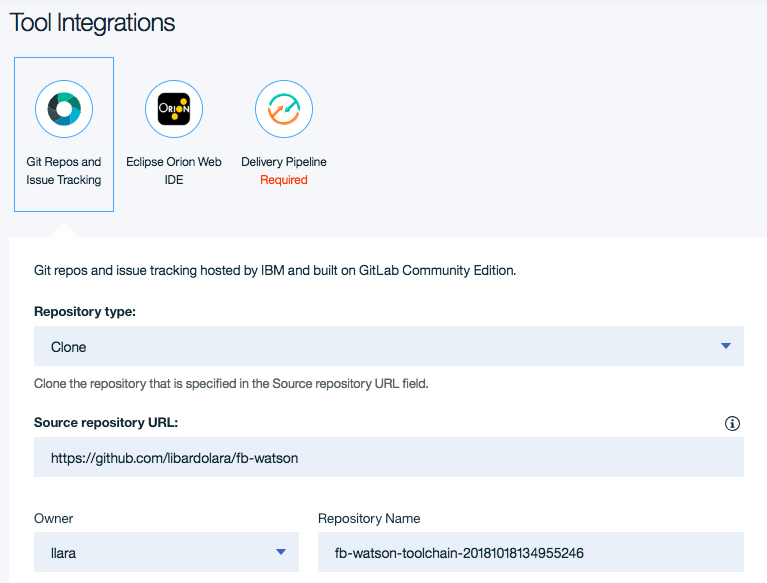
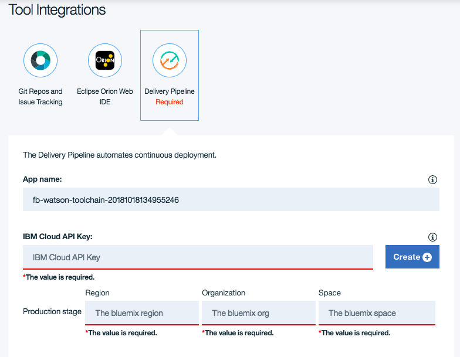
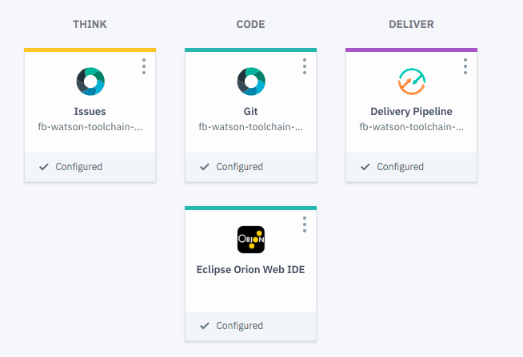
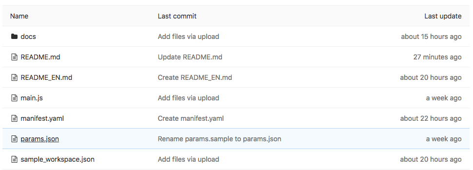
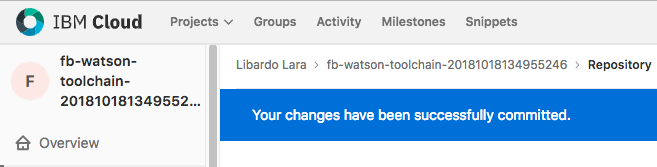
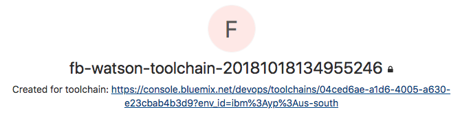

# Instrucciones para el Despliegue con el Toolchain

Para desplegar esta función puedes usar el toolchain haciendo click en el boton []

# Paso a Paso

### 1. Configurar el Toolchain

1. En la pagina principal de la configuración del toolchain selecciona la region de IBM Cloud donde quieres guardar el toolchain
2. Si deseas puedes cambiar el nombre del toolchain

### 2. Configurar el repositorio Git

1. En la sección de Tool Integration esta seleccionado el nodo Git Repo
2. Si deseas puedes cambiar el nombre del repositorio

### 3. Configurar el Pipeline

1. En la sección de Tool Integration selecciona el nodo Delivery Pipeline
2. Has click en *Create* para crear un un IBM Cloud API Key

3. Cambia el nombre de la App, es decir de la función que se desplegará en IBM Cloud
4. Asegurate que la Region, Organizacion y Espacio esten definidos adecuadamente.

5. Has click en Create para crear el toolchain

### 4. Revisar el Toolchain

1. Espera que el Toochain se cree completamente
2. Has click en el nodo de Git
3. En la pagina del repositorio Git, revisa los archivos y has click en el archivo `params.json`

4. Has click en Edit

5. Modifica estos valores con los que habias guardado a lo largo de las instrucciones de pattern
6. Has click en Commit para publicar los cambios
7. Para volver al toolchain, has click en el nombre del toolchain en la esquina superior izquierda

8. Has click en el link del toolchain

7. Has click en el nodo Delivery Pipeline
8. Asegurate de que haya corrido el nodo BUILD que despliega tu funcion en IBM Cloud
9. Para revisar tu funcion puedes ir a https://console.bluemix.net/openwhisk/actions
