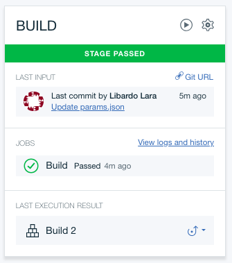

# Instrucciones para el Despliegue con el Toolchain

Para desplegar esta función puedes usar el toolchain haciendo click en el boton 

# Paso a Paso

### 1. Configurar el Toolchain

* En la pagina principal de la configuración del toolchain selecciona la region de IBM Cloud donde quieres guardar el toolchain
* Si deseas puedes cambiar el nombre del toolchain

### 2. Configurar el repositorio Git

* En la sección de Tool Integration esta seleccionado el nodo Git Repo
* Si deseas puedes cambiar el nombre del repositorio

### 3. Configurar el Pipeline

* En la sección de Tool Integration selecciona el nodo Delivery Pipeline
* Has click en *Create* para crear un un IBM Cloud API Key

* Cambia el nombre de la App, es decir de la función que se desplegará en IBM Cloud
* Asegurate que la Region, Organizacion y Espacio esten definidos adecuadamente.

* Has click en Create para crear el toolchain

### 4. Revisar el Toolchain

* Espera que el Toochain se cree completamente
* Has click en el nodo de Git
* En la pagina del repositorio Git, revisa los archivos y has click en el archivo `params.json`

* Has click en Edit

* Modifica estos valores con los que habias guardado a lo largo de las instrucciones de pattern
* Has click en Commit para publicar los cambios
* Para volver al toolchain, has click en el nombre del toolchain en la esquina superior izquierda

* Has click en el link del toolchain

* Has click en el nodo Delivery Pipeline
* Asegurate de que haya corrido el nodo BUILD que despliega tu funcion en IBM Cloud
* Para revisar tu funcion puedes ir a https://console.bluemix.net/openwhisk/actions

