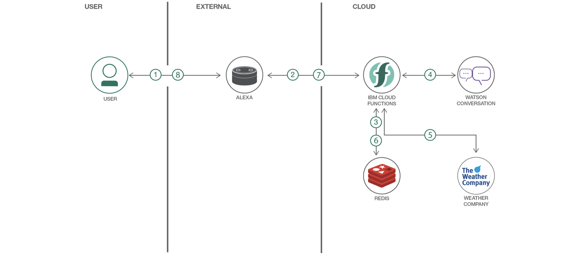
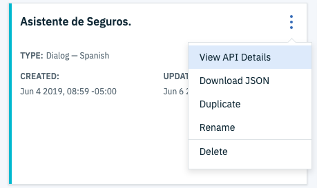
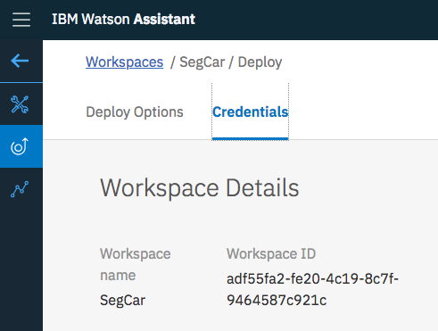

# Conector serverless sencillo para IBM Watson y Facebook Messenger
> For english instructions click [English](README_EN.md)

> Presentación [APIS de Watson](https://ibm.box.com/v/watson-apis-ppt)

Esta aplicación demuestra una función en IBM Cloud (basado en Apache OpenWhisk) que conecta Facebook Messenger con Watson Assistant, Visual Recognition y Watson Discovery guardando el historial de la conversación en una base de datos Cloudant.

Una función, o acción, es invocada a través de un web endpoint provisto por IBM Cloud Functions y este es llamado por Facebook Messenger a través de su Webhook. El mensaje es enviado a Watson Assistant para interactuar con un virtual agent, si el mensaje es una imagen es enviado a Watson Visual Recognition.

Después de terminar este pattern usted entenderá como: 

* Usar Watson Assistant
* Usar Watson Visual Recognition
* Crear y Desplegar Cloud Functions



## Flujo

1. El usuario interactúa con Facebook Messenger
2. Facebook Messenger envía al payload a IBM Cloud Functions
3. La función (o acción) busca por un historial de chat en la base de datos Cloudant.
4. La función envia el mensaje de texto a Watson Assistant.
5. Si es necesario la función enviaría una imagen adjunta a Watson Visual Recognition.
5. Si es necesario la función buscará en Watson Discovery la respuesta para el usuario.
6. La función guarda el historial del chat en la base de datos Cloudant.
7. La función envía la respuesta a Facebook Messenger.
8. El usuario obtiene la respuesta para su interacción.

## Componentes Incluidos

* [Cloudant](https://cloud.ibm.com/catalog/services/cloudant): Una base de datos completamente manejada diseñada para aplicaciones web y mobile modernas que usan documentos como JSON.
* [Watson Visual Recognition](https://www.ibm.com/watson/developercloud/visual-recognition): Visual Recognition usa algoritmos de deep learning para identificar escenas, objetos y rostros en una imagen. Puede crear y entrenar clasificadores customizados para identificar patrones para tus necesidades.
* [Watson Assistant](https://www.ibm.com/watson/developercloud/assistant): Watson Assistant service combina machine learning, natural language understanding e integra herramientas de dialogo para crear flujos conversacionales entre los usuarios y las aplicaciones.
* [IBM Cloud Functions](https://cloud.ibm.com/openwhisk) (basado en Apache OpenWhisk): Ejecuta código bajo demanda en un ambiente serverless y altamente escalable.

## Tecnologías Importantes

* [Watson](https://www.ibm.com/watson/developer/): Watson en IBM Cloud permite integrar herramientas de AI en tu aplicación y guardar, entrenar y manejar tu data en una nube segura.
* [Serverless](https://www.ibm.com/cloud-computing/bluemix/openwhisk): Una plataforma basada en eventos que permite ejecutar código como respuesta a un evento.

## Prerrequisitos

* [IBM Cloud Functions CLI](https://cloud.ibm.com/openwhisk/learn/cli) para crear cloud functions desde la terminal. Haz una prueba de una acción `ibmcloud wsk action invoke /whisk.system/utils/echo -p message hello --result` para que tu `~/.wskprops` apunte a la cuenta correcta.

* [Whisk Deploy _(wskdeploy)_](https://github.com/apache/incubator-openwhisk-wskdeploy) es una herramienta que ayuda a describir y desplegar cualquier componente de OpenWhisk usando un archivo Manifest escrito en YAML. Lo usuarás si deseas hacer el despliegue de todos los recursos de Cloud Functions en una sola línea de comandos. Puedes descargar en [releases page](https://github.com/apache/incubator-openwhisk-wskdeploy/releases) y seleccionar el archivo correcto para tu sistema operativo.

## Paso a Paso

### 1. Clonar el repo

Clona el repositorio `fb-watson` localmente. En una terminal, ejecuta:

```
$ git clone https://github.com/libardolara/fb-watson
```

### 2. Crear el servicio Watson Assistant

Crea un servicio de [Watson Assistant](https://cloud.ibm.com/catalog/services/watson-assistant).
* Copia el API Key en las Credencials the Credentials y pégala en el archivo `params.json` en el valor `wa_api_key`

> Si el servicio es antiguo y aun usa _Basic Authentication_, copia el username y password en las Credenciales y pégalos en el archivo `params.json` en los valores `wa_username` y `wa_password`

* Haz click en el botón **Lanzar Herramienta** en la página principal del servicio.
* Crea un nuevo Skill en el lenguaje preferido o importa el ejemplo en español [sample_workspace.json](sample_workspace.json) 

> Para instrucciones detalladas en como desarrollar un asistente virtual sigue [El Instructivo para desarrollar Asistentes Virtuales](README_Skills.md)

* Después de importar y/o desarrollar el asistente, abre los detalles **View API Details** del Skill, copia el **Workspace ID** y pégala en el archivo `params.json` en el valor `wa_workspace_id`





### 3. Crear el servicio Watson Visual Recognition

Crea un servicio de [Watson Visual Recognition](https://cloud.ibm.com/catalog/services/visual-recognition).
* Copia el API Key en las Credenciales y pégala en el archivo `params.json` en el valor `vr_api_key`

> Sigue las instrucciones detalladas de como entrenar un modelo de clasificación en [El Instructivo para Custom Models](README_CM.md)

### 4. Crear el servicio Cloudant Database

Crea el servicio [**Cloudant**](https://cloud.ibm.com/catalog/services/cloudant) escogiendo `Use both legacy credentials and IAM` para la opción _Available authentication method_.
* Crea las credenciales para esta instancia y copia la **url** en el archivo `params.json` en el valor `cloudant_url`

### 5. Configurar Facebook Messenger

* Crea un Fan Page en [Facebook](https://www.facebook.com/) como un Negocio o Local
* Usa un nombre único y fácil de buscar para tu Fan Page
* Si aun no la tienes, crea una cuenta en [Facebook Developers](https://developers.facebook.com/)
* Agrega una aplicación
* Agrega a la aplicación el producto **Messenger** haciendo click en Configurar
* Una vez configurada ve a la sección **Generación de token**(o identificador) y selecciona el Fan Page (o Pagina) creada.
* Copia el Token de acceso a la página que Facebook te entrega en el archivo `params.json` en el valor `fb_page_access_token`
* En el archivo `params.json` en el valor `fb_verification_token` define una contraseña propia para tu aplicación.

### 6. Desplegar a Cloud Functions
> Escoge un método de despliegue

#### Desplegar a través de DevOps Toolchain

Haz click en el siguinte botón [](https://cloud.ibm.com/devops/setup/deploy?repository=https%3A//github.com/libardolara/fb-watson-toolchain) y sigue las [instrucciones para desplegar usando el toolchain](README-Deploy-Toolchain.md).

También puedes desplegar directamente desde el CLI siguiendo los pasos de la siguiente sección.

#### Desplegar usando `wskdeploy` 

Este método despliega a Cloud Functions con un comando usando el archivo manifest que especifica el ambiente de despliegue.

Asegúrate tener los parámetros correctos en el archivo `params.json`. Despliega a Cloud Functions usando `wskdeploy`. Esto usa el archivo `manifest.yaml` en la raíz del directorio.

```
$ wskdeploy
```

> Si quieres deshacer el despliegue puedes usar `wskdeploy undeploy`

### 7. Configurar el Webhook de Facebook Messenger

* Copia el Endpoint público de la función desplegada en IBM Cloud
* En el sitio de la aplicación de Facebook Messenger ve a la sección **Webhooks**
* Haz click en **Configurar Webhook**
* En el panel desplegable, pega el Endpoint de tu función. Modifica la extensión de la url de `.json` a `.text`
* En el campo _Verificar Token_ ingresa la contraseña que definiste en el valor de `fb_verification_token` del archivo `params.json`
* En los _Campos de Suscripción_ selecciona la opción **messages**
* Crea el Webhook.
* En _Select a page to subscribe your webhook to the page events_ suscribe la página que se creó.

### 8. Prueba del Asistente Virtual
Buscar en la sección de mensajes la página e iniciar una conversación (desde la cuenta de la persona con la que se creó la página).

> Facebook Developer crea todas las aplicaciones por defecto como una aplicación de pruebas, si deseas publicar la aplicación para que cualquier persona pueda chatear con tu asistente virtual debes seguir los [procesos de revisión](https://developers.facebook.com/docs/apps/review/).
