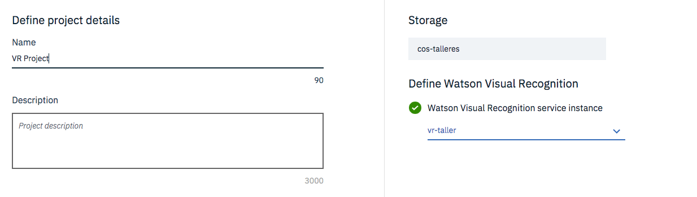
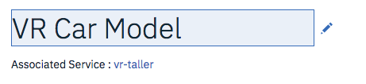
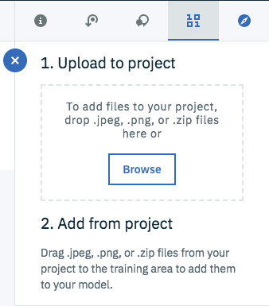
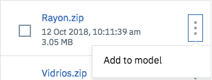
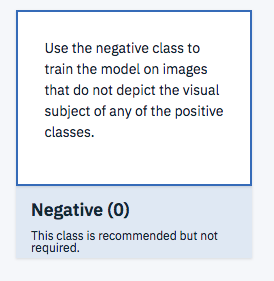

# Crear un Custom Model en Watson Visual Recognition

Watson Visual Recognition permite crear modelos de clasificación de imagenes. Este modelo se realiza a través de un entrenamiento supervisado en el que proveeremos ejmplos positivos y ejemplos negativos de clasificación

> Para mayor información en este proceso puedes revisar la [documentación de los modelos customizados de clasificación](https://cloud.ibm.com/docs/services/visual-recognition?topic=visual-recognition-customizing)

## Paso a Paso

* Haz click en el botón **Lanzar Herramienta** en la página principal del servicio.
* Si es la primera vez que usas Watson Studio, esto preparará el ambiente de trabajo creando un Cloud Object Storage.
* Haz click en el botón _Create Model_ para un custom classifier
* Dele un nombre al proyecto.
* Asegúrate que el Storage y Watson Visual Recognition estén configurados.

* Haz click en el botón _Create_
* Cambia el nombre del modelo de Visual Recognition

* Sube los archivos `.zip` con las clases positivas y las clases negativas.

* Haz click en el menú con los 3 puntos y después selecciona la opción Add Model solamente con las clases positivas.

* Haz click en la clase del sistema Negative

* Arrastra el `.zip` con las imágenes negativas al centro de la pantalla
* Retorna a la página principal del modelo y haz click en el botón Train Model
* Cuando el entrenamiento termine, ve a los detalles del modelo.
* Copia el Model ID y pégalo en el archivo `params.json` en el valor `vr_model_id`
* Puedes probar el modelo en la pestaña Test, arrastrando una nueva imagen para clasificar

> Hemos terminado este ejercicio para crear nuestro asistente virtual de seguros, regresa al tutorial principal [Regresar](README.md#4-crear-el-servicio-cloudant-database)
