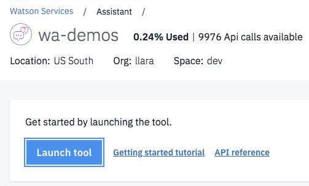
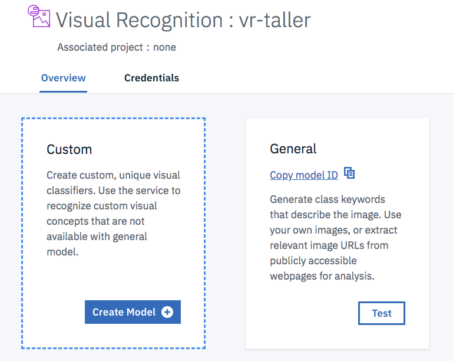

# Simple serverless connector for IBM Watson and Facebook Messenger

The application demonstrate and IBM Cloud Function (based on Apache OpenWhisk) that connects Facebook Messenger with Watson Assitant, Visual Recognition and Watson Discovery saving the chat history in Cloudant database.

One function, or action, is invoked through a web endpoint provided by IBM Cloud Functions and called by the Facebook Messenger Webhook. The message is sent to Watson Assistant to interact with a virtual agent, if the message is an image its sent to Watson Visual Recognition.

After going through this pattern you will understand how to:

* Use Watson Assistant
* Use Watson Visual Recognition
* Create and Deploy Cloud Functions


## Flow

1. User interacts with Facebook Messenger
2. Facebook Messenger sends the payload to IBM Cloud Functions
3. The function (or action) looks up for a past chat history on Cloudant Database.
4. The function sends the text message to Watson Assistant.
5. If need the function will send an attached image to Watson Visual Recognition.
5. If need the function will fallback to Watson Discovery to find the answer for the user
6. The function saves the chat history to Cloudant Database.
7. The function sends the answer to Facebook Messenger.
8. The user gets the answer to his interaction.

## Included components

* [Cloudant](https://console.ng.bluemix.net/catalog/services/cloudant-nosql-db): A fully managed data layer designed for modern web and mobile applications that leverages a flexible JSON schema.
* [Watson Visual Recognition](https://www.ibm.com/watson/developercloud/visual-recognition): Visual Recognition service uses deep learning algorithms to identify scenes, objects, and faces in images you upload to the service. You can create and train a custom classifier to identify subjects that suit your needs.
* [Watson Assistant](https://www.ibm.com/watson/developercloud/assistant): Assistant service combines machine learning, natural language understanding, and integrated dialog tools to create conversation flows between your apps and your users.
* [IBM Cloud Functions](https://console.ng.bluemix.net/openwhisk) (powered by Apache OpenWhisk): Execute code on demand in a highly scalable, serverless environment.

## Featured technologies

* [Watson](https://www.ibm.com/watson/developer/): Watson on the IBM Cloud allows you to integrate the world's most powerful AI into your application and store, train and manage your data in the most secure cloud.
* [Serverless](https://www.ibm.com/cloud-computing/bluemix/openwhisk): An event-action platform that allows you to execute code in response to an event.

# Prerequisites

* [IBM Cloud Functions CLI](https://console.bluemix.net/openwhisk/learn/cli) to create cloud functions from the terminal. Make sure you do the test action `ibmcloud wsk action invoke /whisk.system/utils/echo -p message hello --result` so that your `~/.wskprops` is pointing to the right account.

* [Whisk Deploy _(wskdeploy)_](https://github.com/apache/incubator-openwhisk-wskdeploy) is a utility to help you describe and deploy any part of the OpenWhisk programming model using a Manifest file written in YAML. You'll use it to deploy all the Cloud Function resources using a single command. You can download it from the [releases page](https://github.com/apache/incubator-openwhisk-wskdeploy/releases) and select the appropriate file for your system.

# Steps

### 1. Clone the repo

Clone the `fb-watson` locally. In a terminal, run:

```
$ git clone https://github.com/libardolara/fb-watson
```

### 2. Create Watson Assistant Service

Create a [Watson Assistant](https://console.bluemix.net/catalog/services/watson-assistant-formerly-conversation) instance.
* Copy the username and password in the Credentials section and paste them in the `params.json` file in the values `wa_username` and `wa_password`
* If the service uses IAM API Key authentication, then copy the API Key in the Credentials section and paste it in the `params.json` file in the value of `wa_api_key`
* Click the launch tool button on the service main page



* Create a new Workspace in your preferred language or import the `sample_workspace.json` 
* After creating and/or developing the assistant open the service credentials, copy the Workspace ID and paste it in the `params.json` file in the values `wa_workspace_id`


### 3. Create Watson Visual Recognition Service

Create a [Watson Visual Recognition](https://console.bluemix.net/catalog/services/visual-recognition) instance.
* Copy the API Key in the Credentials section and paste it in the `params.json` file in the value of `vr_api_key`
* Click the launch tool button on the service main page
* If its the first time you use Watson Studio, this will prepare the environment creating a Cloud Object Storage.
* Click the Create Model button for a custom classifier



* Give a name to the project
* Make sure that the Storage and Watson Visual Recognition are set


* Click the Create button
* Change the name of the Visual Recognition Model


* Upload the `.zip` files with the positive classes and the negative class


* Click the 3 button menu and then click the  Add Model only for the positive classes


* Click the Negative default class


* Drag the negative `.zip` into the center of the screen
* Return to the main page of the model and click the Train Model button
* When the trainig is done, go to the model detail view.
* Copy the Model ID and paste it in the `params.json` file in the value of `vr_model_id`
* You can test the model in the Test tab, draging a new image to classify

### 4. Create Cloudant Database

Create a [**Cloudant**](https://console.bluemix.net/catalog/services/cloudant) instance and choose `Use both legacy credentials and IAM` for the _Available authentication method_ option.
* Create credentials for this instance and copy the **url** in the `params.json` file in the value of `cloudant_url`

### 5. Deploy to Cloud Functions
> Choose one of the deployment methods

## Deploy through DevOps Toolchain

Click [](https://console.bluemix.net/devops/setup/deploy/?repository=https%3A//github.com/libardolara/fb-watson-toolchain) and follow the [instructions to deploy using the toolchain](README-Deploy-Toolchain.md).

You can also deploy them directly from the CLI by following the steps in the next section.

## Deploy using the `wskdeploy` command line tool

This approach deploy the Cloud Functions with one command driven by the runtime-specific manifest file available in this repository.

Make sure you have the right parameter variables in the `params.json` file. Deploy the Cloud Functions using `wskdeploy`. This uses the `manifest.yaml` file in this root directory.

```
$ wskdeploy
```

> You may want to undeploy them later with `wskdeploy undeploy`

