# Crear un Skill para Watson Assistant

Los Skills se agregan a tu asistente virtual, que dirige los problemas de los usuarios finales para proporcionar la respuesta adecuada. 
Por lo cual un Skill es un conjuto especifica de habilidades que posee tu asistente virtual para resolver consultas/problemas de tus clientes.

## Paso a Paso

### 1. Crear un Skill

* En la pagina principal del servicio Watson Assistant, haz click en la pestaña **Skills**
* Llena el campo **Name** con el nombre `Asistente de Seguros`
* Selecciona el lenguage español
* Haz click en el botón **Create dialog skill**

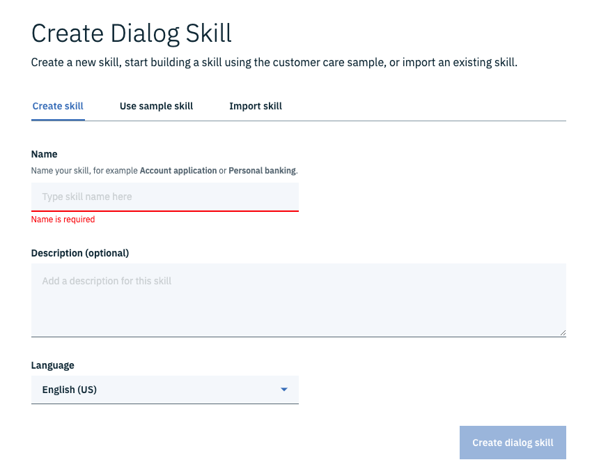

### 2. Entrenando Intents

Al crear intenciones (Intents), capacita a tu asistente para que reconozca las preguntas o los objetivos de los clientes. Y puedes mejorarlos agregando diferentes formas en que las personas dicen lo que están buscando.

* En la pestaña Intent haz click en el botón **Create intent**
* El nombre de la intención sera `PresentarReclamacion`

> Esta Intención representara el objetivo que un cliente tiene para hacer uso de su seguro de vehiculos. Un usuario expresara su deseo de presentar una reclamación sobre un daño o accidente sobre su carro.

* Haz click en el botón **Create intent**
* Agrega ejemplos de como un usuario expresaria su deseo de presentar una reclamació a su seguro vehicular, como por ejemplo:

```
Presentar un reclamo por daños causados
¿Cuál es el proceso para presentar un reclamo?
¿Qué se debe hacer para presentar un reclamo?
¿Cuáles son los pasos para presentar una reclamación por un vehículo?
Quiero reparar mi carro
Quiero hacer uso de mi seguro de vehiculo
quiero realizar una reclamacion
Sufrí un accidente y requiero asistencia para el arreglo
Quiero presentar la solicitud de reparación de mi carro
Le pegue a mi carro, ¿Como puedo solicitar el arreglo?
```

> Estos ejemplos seran usados por Watson Assistant para crear un sistema de classificacion basado en la gramatica y linguistica de los ejemplos. Es importante comentar que los errores de ortografia podrian ser entendidos pero no es una garantia completa, si la palabra cambia drasticamente es buena idea agregar una oración de ejemplo usandola.

* Cuando tengas mas de 10 ejemplos haz click en la flecha hacia la izquierda, que se encuentra en la esquina superior izquierda
* Agrega una intención para Expresar Aceptar o Asentir y una para Negar o Cancelar. Por Ejemplo:

**Aceptar-Si**
```
Si
Claro
Por supuesto
de una
hagale
```

**Negar-No**
```
No
Paila
cancele
ya no
me arrepenti
```


* Ahora vamos a hacer uso del catalogo de contenido que IBM dispone para nosotros como una biblioteca para agilizar el desarrollo de un asistente virtual.
* Haz click en la pestaña **Content Catalog**
* IBM dispone un catalogo con contenido para Banca, Comercio Electronico, Telecomunicaciones, Utilidades, Atención al cliente asi como intenciones para el control del asistente y genericos.
* Haz click en el botón **Add to skill** para la categoria **General**
* Regresa a la pestaña Intents. Deberias ver 10 nuevas intenciones.

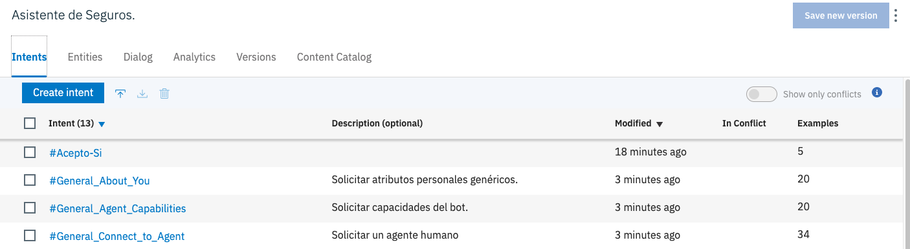

* Haz click en la intención **General_Greetings** y modificala agregando dos ejemplos regionales de como saludan en tu país.
* Regresa a la pestaña de Intents.
* Puedes revisar el resto de intenciones genericas para agregar ejemplos mas regionales.

### 3. Entrenando Entities

Las entidades son como los sustantivos o palabras clave. Trabajan para identificar la naturaleza específica de la solicitud de un cliente. Al construir los términos de tu negocio en entidades, tu asistente puede proporcionar respuestas dirigidas a una variedad más amplia de consultas.

#### 3.1. Entities basadas en Sinónimos

* Haz click en la pestaña **Entities**
* Haz click en el botón **Create entity**
* El nombre de la primera entidad sera `Marca`
* Despues de ingresar el nombre de la entidad, haz click en el botón **Create entity**
* Agrega marcas de carros, tales como Toyota, Mazda, Audi, BMW, etc. como valores. Si es necesario puedes ingresar ejemplos de sinonimos con los cuales los usuarios se pueden referir a una marca.

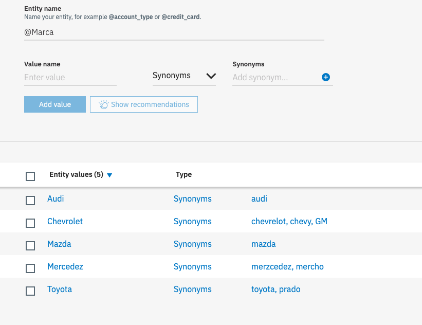

#### 3.2. Entities basadas en Patrones

* Ahora vamos a crear una entidad utilizando un patron linguistico. Vuelve a la pestaña de entidades (haciendo click en la flecha que queda en la esquina superior izquierda)
* Haz click en el botón **Create entity**
* El nombre de la primera entidad sera `Placa`
* Agrega un valor llamado `Carro`
* Cambia la opción **Synonyms** por **Patterns**
* En el campo Patterns ingresa el patrón `\b[a-zA-Z]{3}.?\d{3}\b` y haz click en el botón **Add value**

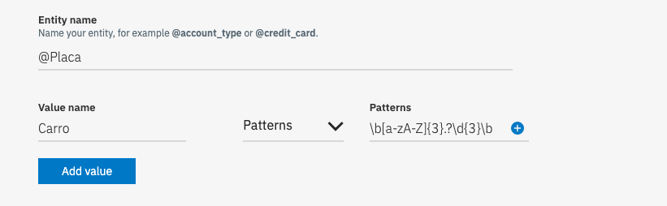

#### 3.3. Entities del Sistema

* Ahora vamos a usar una entidad del sistema. Vuelve a la pestaña de entidades (haciendo click en la flecha que queda en la esquina superior izquierda)
* Haz click en la pestaña **System entities**
* Observa las diferentes entidades del sistema, entre ellas encontraras moneda, fecha, numeros, porcentaje y tiempo.
* Haz click para activar el uso de la entidad **sys-date**

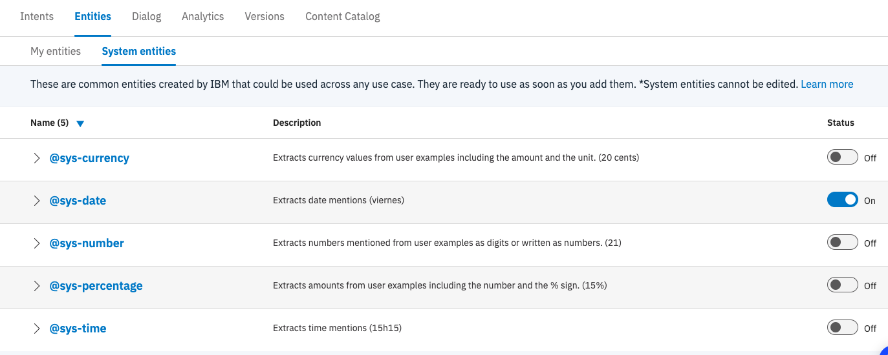

> Para mayor información puedes revisar la [Documentación de Entidades](https://cloud.ibm.com/docs/services/assistant?topic=assistant-entities#entities-create-dictionary-based)

### 4. Probar el asistente 

Vamos a hacer uso del panel de prueba. Este panel te permite probar el entendimiento de las intenciones, la identificación de las entidades y el flujo del dialogo. En este momento solo vamos a probar las intenciones y la entidades.

* Haz click en el botón **Try it**, que se encuentra en la esquina superior derecha
* Escribe una frase de prueba como por ejemplo, `quiero que me ayudes para que arreglen mi carro`
* Observa que la intención detectada es desplegada dentro de la lista desplegable en azul con un **#**.
* Si la intención detectada es incorrecta puedes hacer click en la lista desplegable y corregir la clasificacón seleccionando la intención correcta.
* Escribe la palabra `Masda`
* Observa que la entidad identificada es deplegada en azul claro, con un **@**
* Realiza las pruebas suficientes para la identificación de intenciones y entidades.
* Siempre que termines o vayas a hacer una nueva prueba es recomendable hacer click en el enlace **Clear** en el panel de pruebas.


### 4. Construir el Dialogo

Un diálogo es donde desarrollas flujos de interacción para conversaciones entre tus clientes y tu asistente. Diseñas conversaciones usando intenciones y entidades para que tu asistente responda adecuadamente a lo que sus clientes están diciendo.

El dialogo esta constuidos por nodos, cada nodo consta principalmente de una condición(Si el asistente identifica...) y una respuesta. El asistente revisa desde arriba hacia abajo los nodos, en orden, evaluando cada condición de cada nodo, cuando se cumple alguna condición se devuelve al usuario la respuesta de dicho nodo.


Si un nodo posee un flujo conversacional adicional, lo que conocemos como nodos hijos, la siguiente interacción por parte del usuario se evaluara contra las condiciones de los nodos hijos, de arriba hacia abajo.


> Para mayor información puedes revisar la [documentación general de dialogos](https://cloud.ibm.com/docs/services/assistant?topic=assistant-dialog-overview)

#### 4.1. Dialogo Basico

* Haz click en la pestaña **Dialog**
* Haz click en el botón **Create dialog**
* Observa que por defecto se crea un arbol conversacional con 2 nodos. **Bienvenido** y **En otras cosas**. El nodo de _Bienvenido_ es usado para que el asistente sea el primero en saludar, usado principalmente cuando el asistente esta en una pagina web o una aplicación movil. El nodo _En otras cosas_ es usado cuando no se identifica una condicón en los demas nodos, este deberia estar siempre de ultimo.

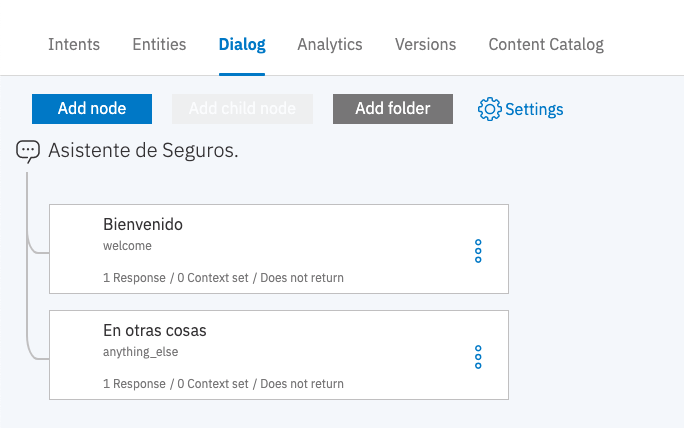

* Cada nodo puede ser diseñado como un flujo de interacciones para cada conversación.
* Vamos a crear un nuevo nodo, haz click en el botón **Add node**

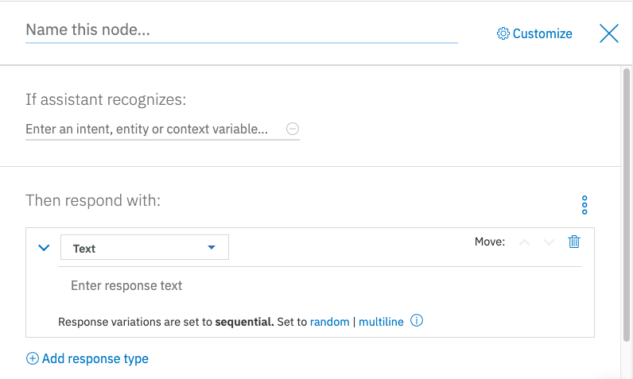

* El nombre del nodo sera `Saludo`
* En la condición de reconocimiento del asistente, filtra la intención **General_Greetings**

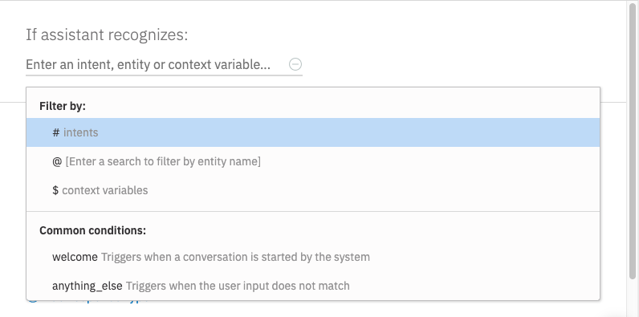

* En la respuesta del asistente observa que puedes escoger entre, Texto, Opción Multiple, Pausa e Imagen. Para mayor información revisa la [documentación de los tipos de respuestas](https://cloud.ibm.com/docs/services/assistant?topic=assistant-dialog-overview#dialog-overview-multimedia)

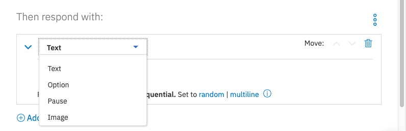

* En el campo de respuesta escribe las respuestas `Hola, soy Watson tu asistente de seguros`y `Mucho gusto, soy el asistente virtual de seguros.` O otras respuestas a un saludo del cliente.
* En las variantes de respuesta selecciona la opción **Random** para que el asistente seleccione de forma aleatorea una de las diferentes respuestas que le especificaste. Para mayor información revisa la [documentación de las variantes a una respuesta](https://cloud.ibm.com/docs/services/assistant?topic=assistant-dialog-overview#dialog-overview-add-variety)

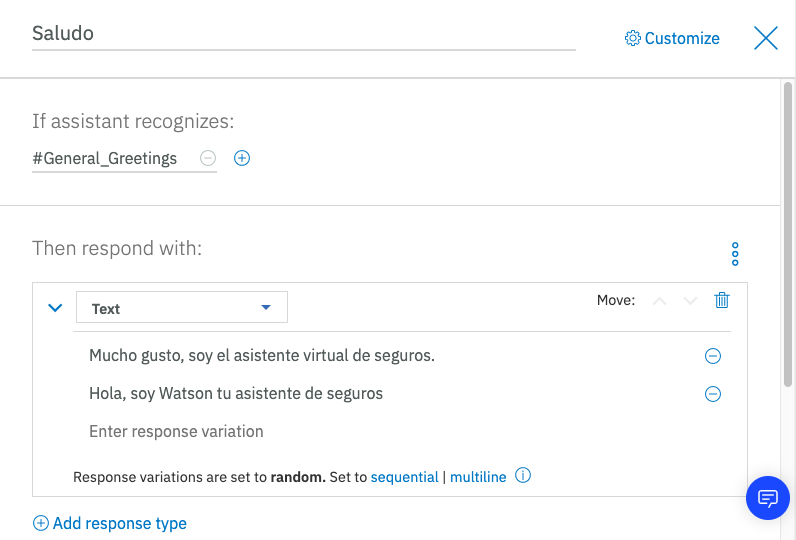

* Repite este proceso para agregar nodos para las intenciones de despededida (General_Ending), chistes (General_Jokes) y capacidades del asistente (General_Agent_Capabilities)

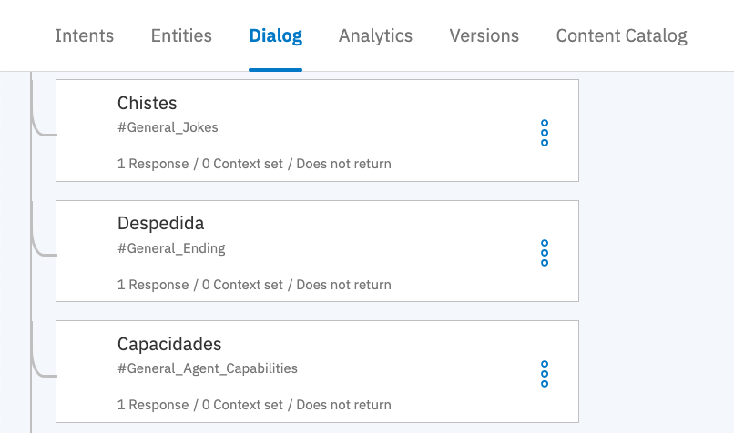

#### 4.2. Adquiriendo información a través de Slots

Los slots te permiten recopilar la información que tu asistente virtual necesita para responder a un usuario dentro de un solo nodo. Un slot puede ser traducido como un espacio en blanco, que tu asistente necesita llenar como información vital para ese nodo.

* Crea un nodo llamado `Presentar Reclamación` y como condición especifica que el asistente reconzca la intención **PresentarReclamacion**
* Haz click en el enlace **Customize**
* En el panel emergente haz click para activar el uso de los Slots para este nodo y despues haz click en el botón **Apply**

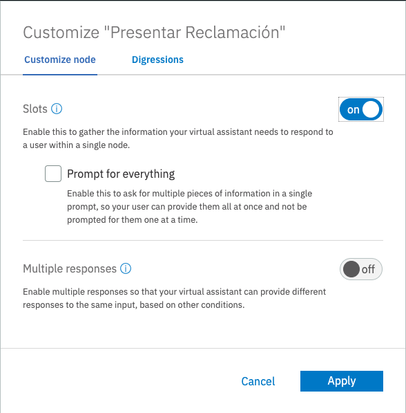

* Observa que ahora el nodo tiene un panel adicional para espeficar la información requerida.
* En el campo **Check for** especifica la entidad **@Marca**, en el campo **If not present ask** escribe que quisieras que el asistente responda si no encuentra la entidad, por ejemplo `¿Cuál es la marca del carro?`
* Observa que la entidad detectada sera guardada en una variable de contexto identificada com **$**. Estas variables nos siven como la memoria del asistente y pueden ser usadas en cualquier parte del nodo, ya sea como condicón o respuesta.
* Repite este proceso para la entidad **@sys-date** preguntando `¿Cuando ocurrio el incidente?`. Para esto primero haz click en el enlace **Add slot**.
* Para a entidad de placa especifica **@Placa.literal** en el campo **Check for** y en el campo **If not present ask**  la pregunta `¿Cuál es la placa del carro?

> la instrucción **.literal** indica que se desea guardar la palabra que el usuario escribio mas no su clasificación de la entidad. Si no lo usaramos para la placa obtendriamos el valor _Carro_ ya que entenderia que es una placa de carro.

* En la respuesta del nodo podremos usar las variables de contexto de la siguiente forma: `Tu reclamación describe que sufriste un accidente el dia $date sobre el carro $Marca y placa $Placa, ¿deseas presentar la reclamacón en este momento?`

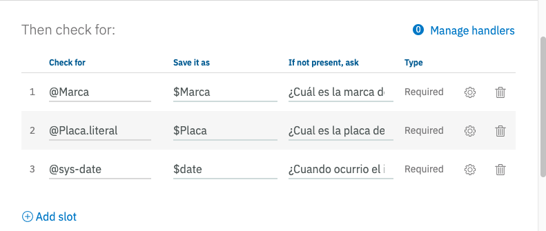

* Utiliza el panel de pruebas para probar esta funcionalidad, escribele una oración como `quiero que me ayudes para que arreglen mi carro` y sigue el flujo de la conversación

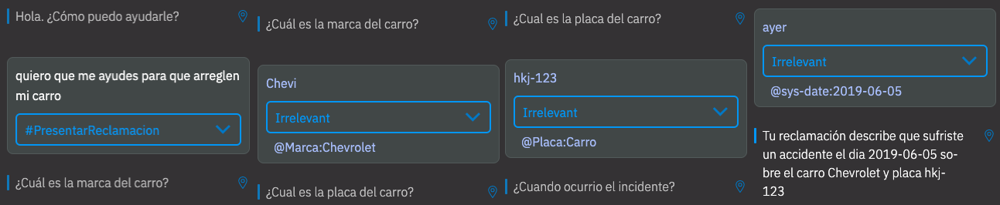

> Para mayor información revisa la [documentación de recopilación de informacion con Slots](https://cloud.ibm.com/docs/services/assistant?topic=assistant-dialog-slots)

#### 4.3. Conversaciones que divagan

Digressions permiten que el flujo de diálogo sea dirigido por el usuario. Tu determinas qué tan flexible puede ser el flujo por nodo de diálogo, desde solo proporcionar una respuesta rápida a una pregunta fuera de tema hasta temas totalmente cambiantes en medio de una discusión.

* En el nodo **Presentar Reclamación** haz click en el botón **Customize**
* Haz click en la pestaña **Digressions** del panel emergente
* Haz click en la opción **Digressions can go away from this node** 
* Activa la opción para el nodo pueda divagar mientras esta llenando la información de los Slots.
* Como nuestro nodo de Presentar Reclamación es tal vez el mas importante de nuestro asistente virtual, vamos a garantizar que complete el proceso. Para esto vamos a seleccionar la opción **Only digress from slots to nodes that allow returns**
* Haz click en el botón **Apply**

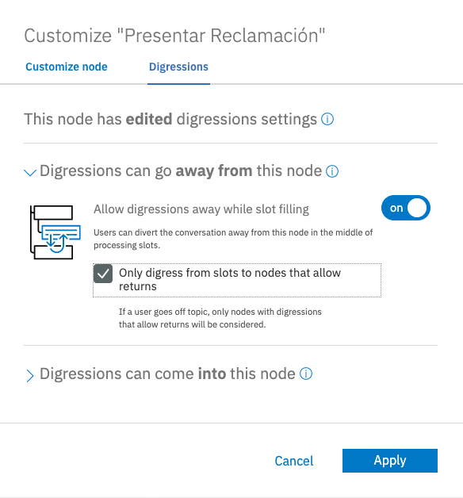

* Ahora vamos a especificar que nodos van a garantizar regresar a la conversación inicial una vez el usuario divague o cambie de tema. Para esto vamos a usar el nodo de **Chistes**, haz click en el botón **Customize** para este nodo.
* Haz click en la pestaña **Digressions** del panel emergente
* Haz click en la opción **Digressions can come into this node** 
* Seleccionar la opción **Return after digression** para que este nodo regrese a la conversación original cuando venga de un cambio de tama.
* Haz click en el botón **Apply**

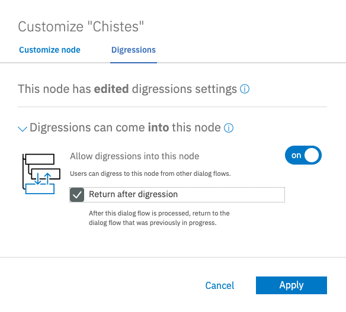

* Prueba esta nueva respuesta en el panel de pruebas con una frase como `quiero que me ayudes para que arreglen mi carro` y en medio de las preguntas que el asistente te hace como _¿Cuál es la marca del carro?_ pregunta por un chiste `cuentame un chiste` 

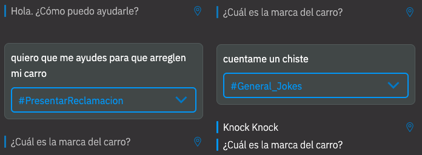

> Digressions te permite cambiar de tema/conversación con flexibilidad desde un slot o un flujo conversacional. Esta funcionalidad nos permite hacer mas reales las capacidades conversacionales del asistente virtual, con conversaciones menos lineales y estructuradas. Para mayor informacíon puedes revisar la [documentación de Digressions](https://cloud.ibm.com/docs/services/assistant?topic=assistant-dialog-runtime#dialog-runtime-digressions)

#### 4.4. Nodos con Multiples Respuestas

Habilita un nodo con varias respuestas para que tu asistente virtual pueda proporcionar respuestas diferentes a la misma entrada, en función de otras condiciones.

* En el nodo **Presentar Reclamación** haz click en el botón **Customize**
* En el panel emergente, haz click para acticar **Multiple responses**

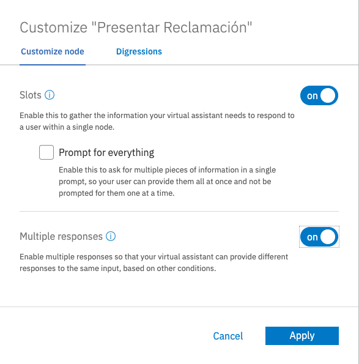

* Observa como el panel de respuestas ha cambiado. Ahora tiene una condición y una respuesta que se puede configurar con las opciones normales del asistente.
* Agrega una respuesta haciendo click en el botón **Add response**
* En la condición de la respuesta, selecciona la entidad **Marca** y que sea el valor **Audi**.
* Como respuesta especificaremos que `Los Audis deben acercarse a cualquier taller autorizado con la poliza de seguro y son aceptados inmediatamente`
* El asistente virtual evalua las condiciones dentro del nodo en orden, de arriba hacia abajo. Como la primera respuesta que tenemos no tiene condición espeficica siempre se evalua como verdadera, por lo cual debemos cambiarlas de lugar.
* Sobre la ultima respuesta, haz click en la flecha hacia arriba **^** que se encuentra en el numero de la respuesta.

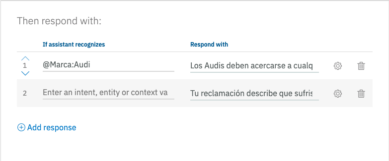

* Prueba esta nueva respuesta en el panel de pruebas

> Para mayor información revisa la [documentación de multiples respuestas](https://cloud.ibm.com/docs/services/assistant?topic=assistant-dialog-overview#dialog-overview-multiple)

#### 4.5. Nodos Hijos

Continuaremos el desarrollo de nuestro arból conversacional, con los diferentes flujos de interacciones dentro de nuestro asistente virtual.

* En el nodo **Presentar Reclamacion** haz click sobre el botón de los 3 puntos y haz click sobre la opción **Add child node**

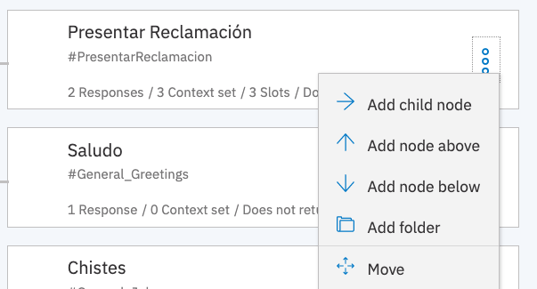

* Este nuevo nodo hijo será para la opcion en que el usuario acepta enviar la reclamación en este momento. Llamaremos al nado **Si** y su condición sera reconocer la intención **Aceptar-Si**
* Crea otro nodo hijo para **Presentar Reclamacion**. Esta vez llama al nodo hijo **No** y que reconozca la intención **Negar-No**

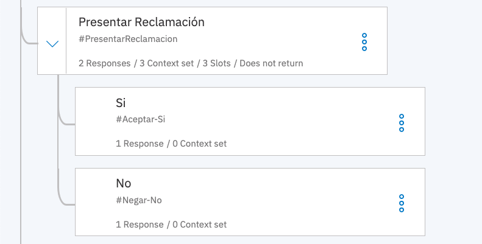

* En el nodo **Si** agrega la respuesta `Por favor envíame una foto del daño`
* En el nodo **Si** haz click sobre el botón de los 3 puntos y haz click sobre la opción **Add child node**
* Este nuevo nodo hijo será para recibir la foto del daño, sin embargo la foto no la va a recibir realmente el servicio Watson Assitant, nuestra aplicación recibira la imagen y la evaluará usando el servicio Visual Recognition. A nuestro asistente virtual llegará una variable de contexto que llamaremos **$images**
* Como nombre de este nuevo nodo usaremos **Imagen**, como condición **$images** y como respuesta usaremos el siguiente código

```
Imagen dectectada: <? $images.images.![classifiers.![classes.![class].join(', ')].join(', ')].join(', ')  ?>
```
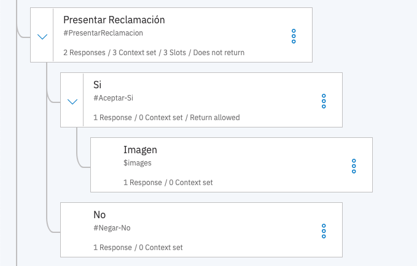

> Watson Assistant permite usar código en sus respuesta o en el manejo de variables de contexto. Se utilizan los tags **<?** y **?>** para abrir y cerrar una inyección de codigo. Para mayor información puedes revisar la [documentación de los metodos de expresiones de lenguaje](https://cloud.ibm.com/docs/services/assistant?topic=assistant-dialog-methods)

> Para mayor información acerca del [entendimiento del dialogo revisa la documentación](https://cloud.ibm.com/docs/services/assistant?topic=assistant-dialog-depiction)


#### 4.6. Reutilización de conversaciones.

Para finalizar vamos a mostrar como podemos reutilizar conversaciones o saltar de forma programada entre nodos. Esto nos evitará el re-trabajo

* Agrega un nuevo nodo en la raiz del asistente.
* Llama al nodo **Algo mas** y por condición usa la expresión **false** ya que no queremos que entre a este nodo a menos que venga de un llamado programado.
* Por respuesta usaremos la frase `¿Puedo ayudarte en algo mas?`

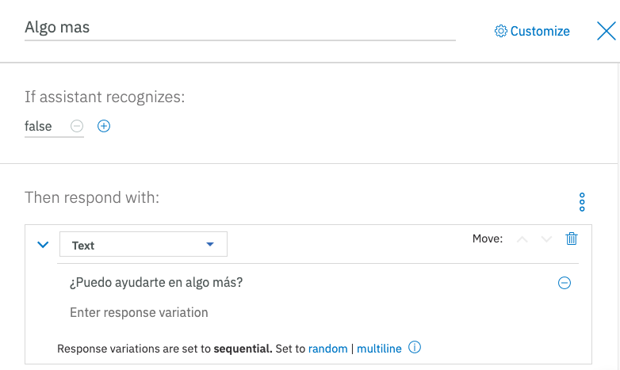

* En el nodo hijo **No** de la conversación **Presentar Reclamación**, haz click en el botón de los 3 puntos y escoge la opción **Jump to**

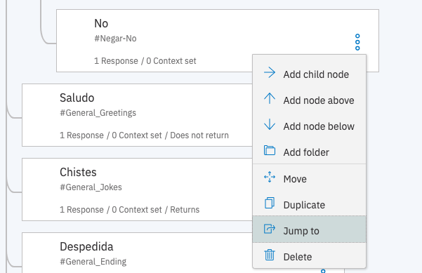

* Selecciona el nodo **Algo mas**, observa que tienes 3 opciones, esperar a que el usuario haga una interacción antes de saltar, saltar y evaluar la confición del nodo, o saltar directamente al a repuesta. Selecciona la opción **Respond**


* Realiza el mismo procedimiento para que el nodo **Imagen** tambien salte al nodo **Algo mas**

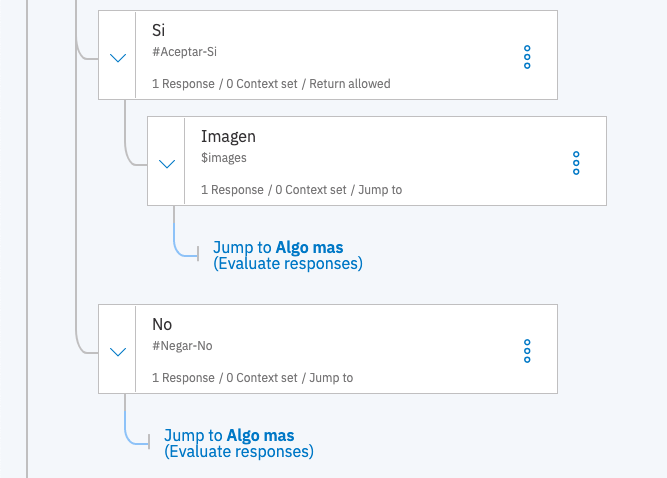

> Hemos terminado este ejercicio para crear nuestro asistente virtual de seguros, regresa al tutorial principal [Regresar](README.md#3-crear-el-servicio-watson-visual-recognition)
